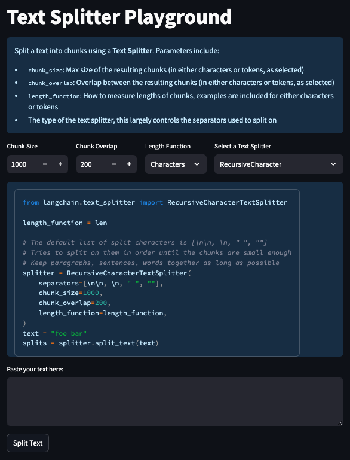

# Text Split Explorer



Many of the most important LLM applications involve connecting LLMs to external sources of data.
A prerequisite to doing this is to ingest data into a format where LLMs can easily connect to them.
Most of the time, that means ingesting data into a vectorstore.
A prerequisite to doing this is to split the original text into smaller chunks.

While this may seem trivial, it is a nuanced and overlooked step.
When splitting text, you want to ensure that each chunk has cohesive information - e.g. you don't just want to split in the middle of sentence.
What "cohesive information" means can differ depending on the text type as well.
For example, with Markdown you have section delimiters (`##`) so you may want to keep those together, while for splitting Python code you may want to keep all classes and methods together (if possible).

This repo (and associated Streamlit app) are designed to help explore different types of text splitting.
You can adjust different parameters and choose different types of splitters.
By pasting a text file, you can apply the splitter to that text and see the resulting splits.
You are also shown a code snippet that you can copy and use in your application

## Hosted App

To use the hosted app, head to [https://langchain-text-splitter.streamlit.app/](https://langchain-text-splitter.streamlit.app/)

## Running locally

To run locally, first set up the environment by cloning the repo and running:

```shell
pip install -r requirements
```

Then, run the Streamlit app with:

```shell
streamlit run splitter.py
```